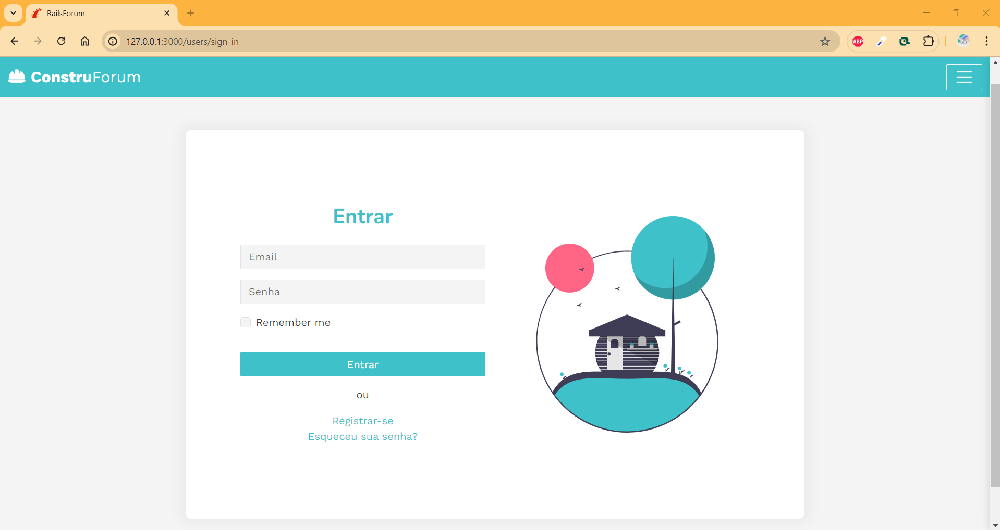
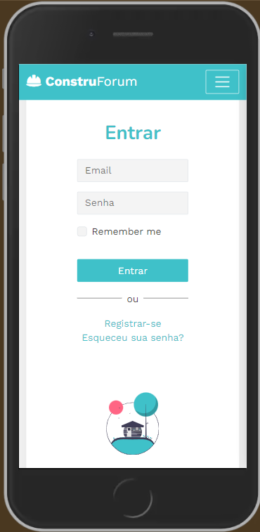
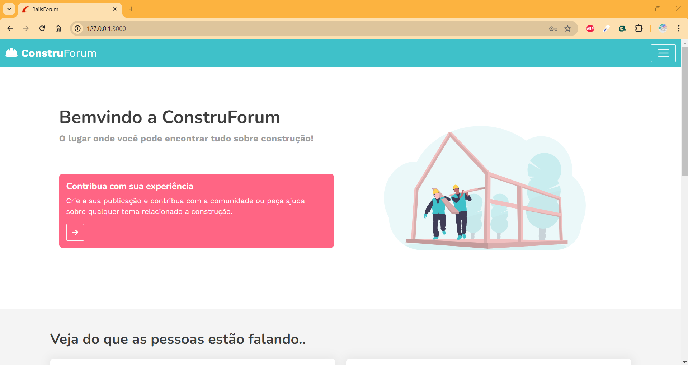
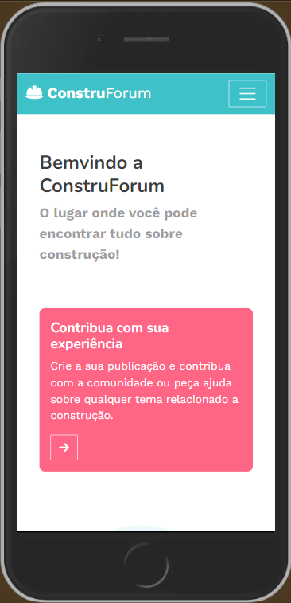
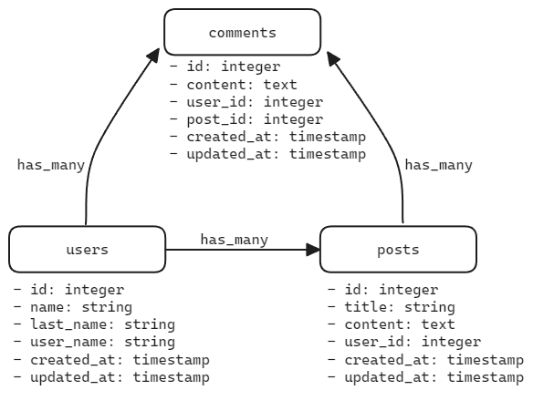

# Projeto: Fórum sobre construção civil
## Sobre o Projeto
Projeto de estudo para uma empresa empresa fictícia que deseja criar um espaço online onde engenheiros, arquitetos, operários e entusiastas da construção possam compartilhar conhecimentos, discutir projetos e resolver dúvidas sobre contrução. Este fórum servirá como uma plataforma para conectar profissionais da área e facilitar a troca de informações técnicas e experiências de campo.

### Stack utilizada
- **Ruby**: 3.1.2
- **Rails**: 7.0.4
- **Banco de Dados**: PostgreSQL
- **Autenticação**: Devise
- **Controle de Permissões**: Pundit
- **Versionamento de Código**: Git
- **Front-end**: Bootstrap

## Funcionalidades

### Autenticação de Usuários:
- Registro de usuários
- Edição de perfil de usuário
- Exclusão de perfil de usuário
- Login
- Logout

### Posts do Fórum:
- Criação de posts (usuários autenticados)
- Edição de posts (usuários autenticados e autorizados)
- Exclusão de posts (usuários autenticados e autorizados)
- Cada post possui um título e um conteúdo
- Cada post está associado a um usuário

### Comentários nos Posts:
- Adição de comentários nos posts (usuários autenticados)
- Exclusão de posts (usuários autenticados e autorizados)
- Cada comentário está associado a um usuário e a um post

## Front-End

### Tela de Login e Cadastro:
- Tela para usuários se registrarem
- Tela para usuários fazerem login

### Navbar:
- Exibe o nome do usuário logado
- Opção para o usuário fazer logout
- Link para "Minhas publicações" que exibe apenas os posts criados pelo usuário logado
- Link para "Editar meu perfil" que exibe o formulário para editar as informações do usuário logado

### Página Inicial:
- Banner com nome do Fórum e convite para escrever a própria publicação
- Exibe todos os posts com o título, uma descrição reduzida e um botão "Ver Mais" para cada post que leva à página de visualização do post completo

### Página de Visualização do Post (Show):
- Exibe o post completo
- Formulário para adicionar comentários abaixo do post e lista de todos os comentários

### Página "Meus Posts":
- Exibir todos os posts criados pelo usuário logado
- Permite que o usuário veja, edite ou delete seus próprios posts

### Preview
|           | Web version                   | Mobile version                       |
| --------- | ----------------------------- | ------------------------------------ |
| **Login** |   |   |
| **Home**  |    |    |


## Configuração e Execução do Projeto

### Pré-requisitos
- Ruby 3.1.2
- Rails 7.0.4
- PostgreSQL

### Passos para configuração

1. **Clonar o Repositório:**
   ```bash
   git clone https://github.com/Aracelimartinez/rails-forum.git
   cd rails-forum
   ```

2. **Instalar Dependências:**
   ```bash
   bundle install
   yarn install
   ```

3. **Configurar Variáveis de Ambiente:**
  Crie um arquivo .env na raiz do projeto e adicione as variáveis necessárias:
    ```bash
      DB_HOST=localhost
      DB_PORT=5432
      DB_USERNAME=seu_usuario
      DB_PASSWORD=sua_senha
    ```

4. **Configurar o Banco de Dados:**
   Crie o banco de dados e configure as credenciais no arquivo `config/database.yml`.

   ```yaml
   default: &default
    adapter: postgresql
    encoding: unicode
    pool: 5
    ## Add this lines to your file config/database.yml
    host: <%= ENV.fetch("DB_HOST") { 'localhost' } %>
    port: <%= ENV.fetch("DB_PORT") { 5432 } %>
    username: <%= ENV.fetch("DB_USERNAME") { 'rails_forum' } %>
    password: <%= ENV.fetch("DB_PASSWORD") { '' } %>
   ```

5. **Criar e Migrar o Banco de Dados:**
   ```bash
   rails db:create
   rails db:migrate
   rails db:seed
   ```

6. **Iniciar o Servidor:**
    ```bash
    rails server
    ```

7. **Acesse a aplicação no navegador:**
    ```bash
    http://localhost:3000
    ```

### Fluxo de Usuários na Aplicação
1. **Home**
  - Usuários cadastrados e não cadastrados podem acessar a home para ver parte do conteúdo postado por usuários cadastrados.
  - Ao clicar no botão "Ver Mais" em casa post exhibido, o usuário é levado para a página de visualização completa do post, onde pode adicionar comentários, caso seja um usuário logado, senão redireciona para a página de login.
  - Link de acesso para criar uma nova publicação caso o usuário esteja logado, senão redireciona para a página de login.

2. **Registro e Login:**
  - Usuários podem se registrar com nome, sobrenome, nome de usuário, e-mail e senha.
  - Após o registro, os usuários podem fazer login e acessar todas as páginas do fórum.
  - Após o login, o nome do usuário aparece na navbar.
  - Usuários podem fazer logout pela navbar.

3. **Interação com Posts:**
  - Usuários autenticados podem criar novos posts.
  - Usuários podem editar e excluir seus próprios posts.
  - Todos os posts são listados na página inicial (Home) com título e descrição reduzida.

4. **Comentários:**
  - Usuários autenticados podem comentar em posts.
  - Usuários autenticados podem adicionar comentários a posts.
  - Comentários são listados abaixo do post na página de visualização.

5. **Meus Posts e Editar Informações:**
  - Na navbar, usuários podem acessar "Minhas publicações" para ver, editar e excluir seus posts.
  - Usuários podem acessar "Editar meu perfil" para atualizar seus dados de perfil.


### Soluções

1. **Integração de Devise e Pundit:**
  - Desafio: Configurar autorização para diferentes ações dos usuários.
  - Solução: Implementação de políticas com Pundit para controlar as permissões de criação, edição e exclusão de posts e comentários.
2. **Front-end:**
  - Desafio: Garantir responsividade do front-end.
  - Solução: Utilização do framework Bootstrap para estilizar e tornar as páginas responsivas.

3. **Base de dados:**
  

  - User, Post e Comment Models:
    - Relações: Um usuário pode ter muitos posts e comentários, enquanto um post pode ter muitos comentários.
    - Referências: Utilizamos chaves estrangeiras para manter a integridade referencial entre as tabelas, garantindo que cada post e comentário estejam sempre associados a um usuário válido.
  - Com esta estrutura simples garantimos a possibilidade de escalar a aplicação e adicionar otras funcionalidades de forma fácil e segura. Por exemplo: adição de uma tabela de likes associados aos posts e usuários onde a relação seja única para evitar mais de um Like por usuário por post.
